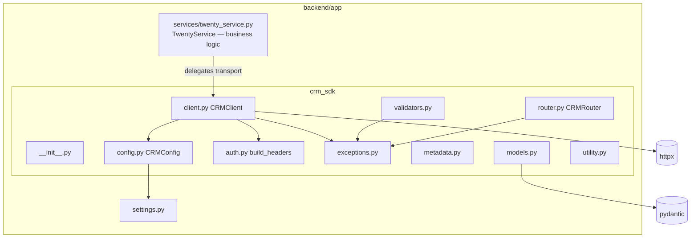

# CRM SDK Foundation — Phase 1.2

**Date:** 2026-07-15
**Phase:** 1.2 (foundation only — no business CRUD)
**Goal:** Extract reusable transport/infrastructure from the working `TwentyService`
into a new `crm_sdk` package, and refactor `TwentyService` to consume it — with
**zero behavior change**.

**Reference (accepted, not re-investigated):** `SKILL_LOADING_ANALYSIS.md`,
`TWENTY_SKILL_V2_AUDIT.md`, `OPENCLAW_TOOL_RUNTIME_ANALYSIS.md`,
`REPOSITORY_SIMPLIFICATION.md`.

> This phase is infrastructure only. **No** Candidate / Requisition / Application /
> Interview / Evaluation / Offer / Workflow logic was built or moved. All business
> logic remains inside `TwentyService`, working exactly as before.

---

## 1. Directory Structure

New package: `backend/app/crm_sdk/` (importable as `app.crm_sdk`).

```
backend/app/crm_sdk/
├── __init__.py       # Public exports (CRMClient, CRMConfig, exceptions, models, router, metadata)
├── client.py         # CRMClient: URL gen, headers, request exec, response parse, error handling, retry (opt-in)
├── config.py         # CRMConfig + CRMConfig.from_settings() (reproduces TwentyService.__init__)
├── auth.py           # build_headers() (bearer + content-type)
├── exceptions.py     # CRMError hierarchy (+ error_for_status mapper)
├── models.py         # Shared models: APIResponse, Pagination, ErrorResponse, RequestContext
├── validators.py     # UUID / required-fields / object-name / pagination validation
├── metadata.py       # MetadataProvider + registries (workspace/version/objects/fields/relationships)
├── utility.py        # unwrap_data + Twenty field-shape builders (email/phone/blocknote)
└── router.py         # CRMRouter dispatch skeleton (namespaces only, no handlers)
```

---

## 2. Extracted Components (from `TwentyService`)

All extraction sourced from `backend/app/services/twenty_service.py`
(`__init__` + `_request`). No code duplicated — `TwentyService` now delegates.

| Concern | Source (old `TwentyService`) | New home | Behavior-preserving? |
| ------- | ---------------------------- | -------- | -------------------- |
| Base URL normalization | `settings.TWENTY_API_URL.rstrip("/")` | `config.py` `CRMConfig.from_settings` | ✅ identical |
| Auth headers | inline `{"Authorization": f"Bearer ...", "Content-Type": ...}` | `auth.py` `build_headers` | ✅ identical dict |
| URL generation | `f"{base_url}/rest/{path.lstrip('/')}"` | `client.py` `CRMClient.build_url` | ✅ identical |
| HTTP execution | `httpx.AsyncClient().request(..., timeout=15.0)` | `client.py` `CRMClient.request` | ✅ same call, `timeout=15.0` |
| Response parsing | `response.json()`, 204 → `{}` | `client.py` `_parse_json` + 204 handling | ✅ identical |
| Error handling | `raise Exception("Twenty CRM Error: ...")` / `"Failed to communicate with Twenty CRM: ..."` | `client.py` → `CRMRequestError` with **same message text** | ✅ subclass of `Exception`, same message |
| Logging | `"Twenty CRM Request/Response/Error..."` | `client.py` (same log lines) | ✅ identical |
| Retry logic | *(none in source)* | `client.py` opt-in (`max_attempts=1` default = off) | ✅ off by default |

**Foundation scaffolding added (not present in source, justified by the V2 audit):**

| Module | Purpose | Wired into runtime now? |
| ------ | ------- | ----------------------- |
| `exceptions.py` | Structured error hierarchy (`CRMError`, `AuthenticationError`, `ValidationError`, `RequestError`, `CRMRequestError`, `RateLimitError`, `NotFoundError`, `ConflictError`) | Only `CRMRequestError` (raised by client). Others reserved. |
| `models.py` | `APIResponse`, `Pagination`, `ErrorResponse`, `RequestContext` (infra only) | No — available for future phases |
| `validators.py` | `validate_uuid`, `require_fields`, `validate_object_name`, `validate_pagination` | No — reserved for router handlers |
| `metadata.py` | `MetadataProvider` + object/field/relationship registries (empty; **no sync**) | No — read-only skeleton |
| `utility.py` | `unwrap_data`, `build_email_field`, `build_phone_field`, `build_blocknote_body` | No — reserved (not yet consumed by TwentyService) |
| `router.py` | `CRMRouter` dispatch skeleton for `candidate.* … metadata.*` | No — no handlers registered |

---

## 3. Components Intentionally Left Inside `TwentyService`

Per the phase rules, **all business logic stays** in `backend/app/services/twenty_service.py`:

- Candidate: `get_candidates`, `get_candidate`, `create_candidate`, `update_candidate`, `delete_candidate`
- Requisition: `get_requisitions`, `get_requisition`, `create_requisition`, `update_requisition`, `delete_requisition`
- Interview: `get_interviews`, `get_interview`, `create_interview`, `delete_interview`
- Notes / Attachments / Timeline business rules: `create_note`, `link_note_to_candidate`,
  `add_note_to_candidate`, `add_attachment_to_candidate`, `add_timeline_activity_to_candidate`
- The inline email/phone shaping *inside* create/update candidate (left as-is to guarantee no behavior change)

> Workflow / Offer / Evaluation / Application logic lives in `TwentySkill` / agents (untouched this phase).

---

## 4. Dependency Graph



**No circular imports:** `config.from_settings` uses a local import of `app.settings`;
the SDK never imports `TwentyService`. Verified at runtime (`import app.main` succeeds).

---

## 5. Before / After Architecture

**Before**
```
FastAPI routes → TwentyService → httpx (inline _request) → Twenty CRM REST → PostgreSQL
```

**After (Phase 1.2)**
```
FastAPI routes → TwentyService (business logic unchanged)
                     → crm_sdk.CRMClient (transport: URL/auth/exec/parse/errors)
                         → httpx → Twenty CRM REST → PostgreSQL
```

Business behavior, routes, and error contract are identical; only the transport
plumbing moved behind `CRMClient`.

---

## 6. Migration Progress

| Layer | Status |
| ----- | ------ |
| Transport/config/auth/errors extracted | ✅ done (TwentyService consumes `CRMClient`) |
| Shared models / validators / metadata / router skeleton | ✅ scaffolded (not wired) |
| Candidate / Requisition / Application / Interview / Evaluation / Offer | ⏳ future phases (unchanged) |
| Workflow / Search | ⏳ future phases |
| Metadata sync (live `/rest/metadata/*`) | ⏳ future phase (skeleton only now) |
| OpenClaw tool plugin (Option D hybrid) | ⏳ future phase |

---

## 7. Future Extraction Candidates

Justified by existing code, to migrate in later phases (not done now to avoid behavior change):

1. **Field-shape builders** — the inline email/phone shaping inside `create_candidate`/`update_candidate`
   can adopt `utility.build_email_field` / `build_phone_field` once tested for parity.
2. **BlockNote note body** — `TwentyService.create_note` can adopt `utility.build_blocknote_body`.
3. **Response unwrapping** — the repeated `response.get("data", {}).get(<key>, ...)` pattern can adopt
   `utility.unwrap_data`.
4. **Object-name mapping** — normalize plural/singular through `metadata` registries.
5. **Richer exception raising** — start raising `NotFoundError`/`ConflictError`/`RateLimitError`
   (via `error_for_status`) once callers are ready to branch on them.
6. **Metadata hydration** — populate registries from `/rest/metadata/objects` and/or Schema V2 defs.

---

## 8. Verification Results

| Check | Command | Result |
| ----- | ------- | ------ |
| Syntax (all backend + crm_sdk) | `python -m py_compile` (recursive over `app/`) | ✅ `SYNTAX OK` |
| Full import graph | `python -c "import app.main"` | ✅ 12 routes (unchanged) |
| TwentyService uses SDK | `isinstance(ts._client, CRMClient)` | ✅ `True` |
| base_url parity | compare `ts.base_url` | ✅ `http://localhost:3000` |
| headers parity | `ts.headers == client.headers` | ✅ `True` |
| URL generation parity | `client.build_url('candidates')` | ✅ `http://localhost:3000/rest/candidates` |
| Error contract parity | forced transport failure | ✅ raises `CRMRequestError` (an `Exception`), message starts `"Failed to communicate with Twenty CRM:"` |
| Router skeleton | `CRMRouter().actions()` | ✅ `[]` (no handlers) |
| Metadata skeleton | `MetadataProvider()` | ✅ version `0.1.0`, no workspace, empty registries (no sync) |
| Static analysis | editor diagnostics on all new files + `twenty_service.py` | ✅ no errors |

**Unchanged (confirmed):** API routes (12), Docker, OpenClaw config/runtime, Schema V2.
No behavior change, no broken imports, no circular imports.

---

## 9. Notes on Scope Discipline

- The SDK contains **no recruiting business logic**.
- Foundation modules beyond `CRMClient`/`CRMConfig`/`build_headers` are **scaffolding**: present and
  tested to import, but deliberately **not wired** into `TwentyService` yet, so this phase cannot
  change any runtime behavior.
- Retry is **off by default** (`max_attempts=1`) because the source had no retry — enabling it is a
  future, opt-in decision.

---

*Every extraction preserves the original `TwentyService` transport semantics exactly. Business logic
was neither moved nor rewritten. The deliverable is a stable CRM SDK foundation that `TwentyService`
already uses internally for transport.*
```
