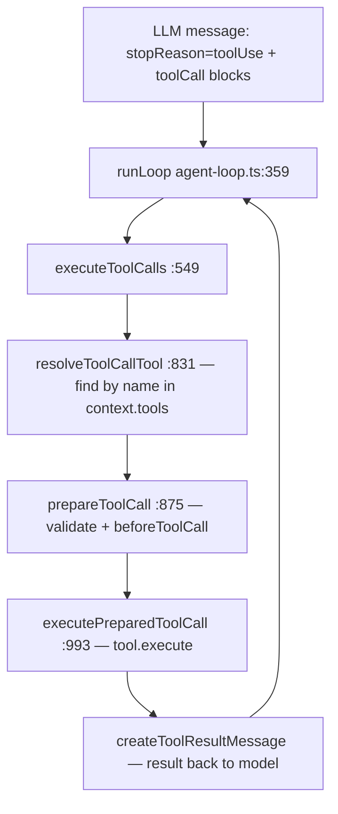
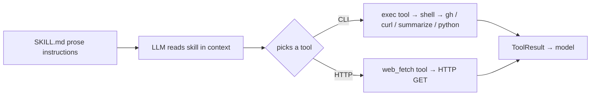
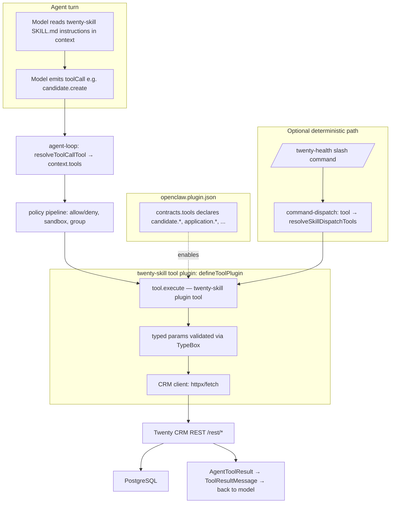

# OpenClaw Tool Runtime Analysis

**Date:** 2026-07-15
**Scope:** How OpenClaw **executes real work** — tool definition, registration, dispatch, and how
skills connect to tools. **Skill *loading* is out of scope** (already covered in
`SKILL_LOADING_ANALYSIS.md`).
**Ground truth:** OpenClaw source at `e:\Code\OpenClaw\repo` + official docs
(`docs/tools/skills.md`, `docs/plugins/tool-plugins.md`, https://docs.openclaw.ai/tools/skills,
https://docs.openclaw.ai/tools/creating-skills).
**Constraint:** No implementation performed. Every conclusion is cited to source.

---

## 0. Executive Summary

- **A `SKILL.md` is an instruction pack, not executable code.** Skills teach the model *how* to use
  tools (in prose). The runtime injects skill text into context; the model then decides which **tools**
  to call. (Confirmed by both the loading analysis and the official docs.)
- **Tools are the unit of execution.** A tool is a typed object `{ name, description, parameters
  (TypeBox schema), label, execute(toolCallId, params, signal, onUpdate) }` — interface `AgentTool` in
  `packages/agent-core/src/types.ts:458`.
- **The agent loop dispatches tools by name.** `agent-loop.ts` matches the model's `toolCall` blocks
  against the per-run `context.tools` array and calls `tool.execute(...)`.
- **Built-in tools** (`exec`, `web_fetch`, `read`/`write`/`edit`, `update_plan`, memory, etc.) are
  ordinary `AgentTool`s assembled per run by `createOpenClawCodingTools` (`src/agents/agent-tools.ts:388`).
- **Bundled skills perform work almost entirely through the `exec` tool (running a CLI)** or the
  `web_fetch` tool (HTTP). Traced: `weather` = `web_fetch` + `exec(curl)`; `github`/`summarize`/
  `model-usage` = `exec` CLI; `trello` = `exec` running `curl`+`jq`. None bind a custom tool.
- **Custom tools are supported via the plugin SDK** (`defineToolPlugin` / `api.registerTool`), and a
  plugin **must declare `contracts.tools` in its manifest** before it can register tools.
- **There is one explicit skill→tool binding**: frontmatter `command-dispatch: tool` + `command-tool`,
  which lets a slash command call a tool directly, bypassing the model.
- **Recommendation for `twenty-skill`: Option D (Hybrid)** — a **plugin that exposes CRM tools**
  (`defineToolPlugin`) **plus a `SKILL.md`** that teaches agents when/how to call them. This is the
  only approach that matches how OpenClaw actually executes work.

---

## 1. Tool Architecture — how tools are defined

OpenClaw has **two layers**; do not conflate them.

### 1.1 The executable contract: `AgentTool` (this is what runs)

`e:\Code\OpenClaw\repo\packages\agent-core\src\types.ts:458–489`:

```ts
export interface AgentTool<TParameters extends TSchema = TSchema, TDetails = unknown>
  extends Tool<TParameters> {
  label: string;
  hideFromChannelProgress?: boolean;
  prepareArguments?: (args: unknown) => Static<TParameters>;
  execute: (
    toolCallId: string,
    params: Static<TParameters>,
    signal?: AbortSignal,
    onUpdate?: AgentToolUpdateCallback<TDetails>,
  ) => Promise<AgentToolResult<TDetails>>;
  executionMode?: ToolExecutionMode;
}
```

- Base `Tool<TParameters>` (from `llm-core`) supplies `name`, `description`, `parameters` (a **TypeBox**
  `TSchema`). Concrete shape = **`name`, `description`, `parameters`, `label`, `execute(...)`**.
- Result — `AgentToolResult<T>` (`types.ts:441`): `{ content: (Text|Image)[]; details: T; progress?;
  terminate? }`.
- The type-erased runtime variant used across OpenClaw is `AnyAgentTool` in
  `e:\Code\OpenClaw\repo\src\agents\tools\common.ts:44–68`.

### 1.2 The descriptor/planning layer (metadata only — does NOT execute)

`e:\Code\OpenClaw\repo\src\tools\types.ts:57–68` defines `ToolDescriptor` (name/description/inputSchema/
owner/executor/availability) used for **visibility/protocol payloads**, not execution.
`defineToolDescriptor` (`descriptors.ts:10`) is an identity function; `ToolExecutorRef`
(`types.ts:28–32`) only tags where a tool *would* run (`core`/`plugin`/`channel`/`mcp`) for diagnostics.

### 1.3 The "registry" is a per-run assembled array (no global mutable registry for core)

Core tools are **not** kept in one mutable registry object. They are assembled per run into an array by
`createOpenClawCodingTools` (`e:\Code\OpenClaw\repo\src\agents\agent-tools.ts:388`), which builds
`const base: AnyAgentTool[] = []` (~line 753) from coding tools + shell tools + OpenClaw tools + plugin
tools, then runs a policy pipeline (allow/deny/group/sandbox). That array becomes `AgentContext.tools`.
(Plugins *do* use a registry — see §8.)

---

## 2. Tool Lifecycle & Dispatch Flow — how an LLM invokes a tool

All in `e:\Code\OpenClaw\repo\packages\agent-core\src\agent-loop.ts`.

**Trigger** — `runLoop`, lines **355–373**:

```ts
const toolCalls = message.content.filter((c) => c.type === "toolCall");
if (message.stopReason === "toolUse" && toolCalls.length > 0) {
  const executedToolBatch = await executeToolCalls(currentContext, message, config, signal, emit);
  toolResults.push(...executedToolBatch.messages);
  hasMoreToolCalls = !executedToolBatch.terminate;
  ...
}
```

Pipeline:

1. **`executeToolCalls`** (line **549**) — filters `toolCall` blocks; chooses sequential
   (`executeToolCallsSequential`:622) vs parallel (`executeToolCallsParallel`:695).
2. **`resolveToolCallTool`** (line **831**) — **tool selection by name**:
   ```ts
   let tool = currentContext.tools?.find((t) => t.name === toolCall.name);
   if (!tool) { const resolvedTool = await config.resolveDeferredTool?.(...); ... }
   ```
3. **`prepareToolCall`** (line **875**) — `prepareArguments` → `validateToolArguments` → optional
   `beforeToolCall` hook (can block).
4. **`executePreparedToolCall`** (line **993**) — the **actual invocation**, line **1003**:
   ```ts
   const result = await prepared.tool.execute(
     prepared.toolCall.id, prepared.args as never, signal,
     (partialResult) => emit({ type: "tool_execution_update", ... }),
   );
   ```
   Failures → `createErrorToolResult(...)`.
5. **`finalizeExecutedToolCall`** (~1030) — `afterToolCall` hook → `createToolResultMessage` builds the
   `ToolResultMessage` appended to the conversation for the next model turn.



---

## 3. Built-in Tool Implementation — where they live

Built-ins are ordinary `AgentTool`s under `e:\Code\OpenClaw\repo\src\agents\tools\` and
`src\agents\bash-tools.*`, assembled by `createOpenClawCodingTools` (`agent-tools.ts:388`).

| Tool | Factory / file | Mechanism |
| ---- | -------------- | --------- |
| **exec / shell** | `createExecTool` — `src\agents\bash-tools.exec.ts:1304` (returns `{name:"exec", parameters:execSchema, execute}` ~1497–1565); singleton `execTool` :2117 | Spawns a real shell process via exec host runtime (`bash-tools.exec-host-node.ts`) |
| **process** (background shell) | `bash-tools.process.ts` | background process mgmt |
| **read / write / edit** | `createCodingTools`/`createReadTool` (sessions) wrapped in `agent-tools.read.ts` | filesystem |
| **apply_patch** | `createApplyPatchTool` — `src\agents\apply-patch.ts` | filesystem patch |
| **web_fetch** | `createWebFetchTool` — `src\agents\tools\web-fetch.ts:774` → `{name:"web_fetch", execute}` :787 | HTTP fetch + readability (no shell) |
| **web_search** | `src\agents\tools\web-search.ts` | HTTP |
| **browser** | plugin `extensions\browser\` (NOT core) | plugin tool |
| **planning (update_plan)** | `src\agents\tools\update-plan-tool.ts`; gated by `shouldIncludeUpdatePlanToolForOpenClawTools` (`openclaw-tools.registration.ts:65`) | context/state |
| **memory** | `memory-search.ts` + memory-flush write wrapper (`agent-tools.read.ts`) | filesystem-backed |
| **message / sessions_* / subagents / cron / media gen** | `src\agents\tools\*.ts` via `createOpenClawTools` (`src\agents\openclaw-tools.ts`) | various |

Key point: `exec.execute` runs the actual command; `web_fetch.execute` performs an HTTP request. These
are the two primitives that virtually all bundled skills rely on.

---

## 4. How a SKILL.md connects to tools

**By default, a SKILL.md is purely prompt instructions injected into context — there is no automatic
tool binding.** The skill body tells the model, in prose, to use existing tools (`exec`, `web_fetch`,
…); the model chooses and calls them through the loop in §2.

- Frontmatter parsing: `src\skills\loading\frontmatter.ts` (`parseFrontmatter`) + `src\shared\frontmatter.ts`.
  The `metadata.openclaw` block gates **eligibility only** (bins/env/os/config), not tool binding.
- **There is no generic `tools:` / `allowed-tools:` field** consumed by the OpenClaw skill runtime.
  (Grep of `src/` for `allowed-tools`/`allowedTools` finds only per-skill CLI-backend text and the
  Anthropic CLI `--allowedTools` arg — not a core binding.)
- **The one explicit binding** is `command-dispatch: tool` (see §5), typed as `SkillCommandDispatchSpec`
  in `src\skills\types.ts:41–50`:
  ```ts
  export type SkillCommandDispatchSpec = { kind: "tool"; toolName: string; argMode?: "raw"; };
  ```

When a plain skill is invoked, its body is rewritten into a prompt
(`src\auto-reply\reply\get-reply-inline-actions.ts:432–447`):
`Use the "<skillName>" skill for this request.\nUser input:\n<args>` → the model then picks tools.

---

## 5. `command-dispatch: tool` / `command-tool` — internals

### 5.1 Frontmatter → spec (`src\skills\discovery\command-specs.ts`, `buildWorkspaceSkillCommandSpecs`, ~130–167)

```ts
const kindRaw = normalizeLowercaseStringOrEmpty(
  entry.frontmatter?.["command-dispatch"] ?? entry.frontmatter?.["command_dispatch"] ?? "");
if (!kindRaw || kindRaw !== "tool") return undefined;
const toolName = (entry.frontmatter?.["command-tool"] ?? entry.frontmatter?.["command_tool"] ?? "").trim();
if (!toolName) { debugSkillCommandOnce(...); return undefined; }
const argMode = !argModeRaw || argModeRaw === "raw" ? "raw" : null;
return { kind: "tool", toolName, argMode: "raw" } as const;
```

Reads `command-dispatch` (must be `"tool"`), `command-tool` (required tool name), `command-arg-mode`
(only `"raw"`). Missing tool → dispatch ignored.

### 5.2 Runtime (bypasses the model) — `src\auto-reply\reply\get-reply-inline-actions.ts:347–429`

```ts
if (dispatch?.kind === "tool") {
  const rawArgs = (skillInvocation.args ?? "").trim();
  const authorizedTools = resolveSkillDispatchTools({ ...ctx, skillCommand: { toolName: dispatch.toolName } });
  const tool = authorizedTools.find((c) => c.name === dispatch.toolName);
  if (!tool) return { kind:"reply", reply: `❌ Tool not available: ${dispatch.toolName}` };
  const result = await tool.execute(`cmd_${generateSecureToken(8)}`,
    { command: rawArgs, commandName: ..., skillName: ... }, opts?.abortSignal);
  return { kind:"reply", reply: extractTextFromToolResult(result) ?? "✅ Done." };
}
```

### 5.3 Security seam — `src\skills\runtime\tool-dispatch.ts:59` (`resolveSkillDispatchTools`)

Its header (lines 51–55) ties it to advisory `GHSA-mhm4-93fw-4qr2`. It rebuilds the full tool set via
`createOpenClawTools(...)` and runs the **same policy pipeline** (`applyToolPolicyPipeline` ~198–240) —
allow/deny, group, sender, sandbox, subagent — before returning the callable tool. So a
`command-dispatch: tool` call is gated identically to a model-invoked call.

**Plain skill vs `command-dispatch: tool`:** the former prompts the model (which then calls tools); the
latter is a **deterministic slash command that calls a tool directly, skipping the model**.

---

## 6. Custom Tool Support (Plugins/SDK)

**Yes** — via the plugin SDK. There are two levels.

### 6.1 High-level: `defineToolPlugin` (`src\plugin-sdk\tool-plugin.ts`)

Tool declaration `ToolPluginToolDefinition` (`tool-plugin.ts:63–85`) accepts **either** `execute` **or**
a `factory`:

```ts
export type ToolPluginToolDefinition<TConfig, TParamsSchema extends TSchema> =
  ToolPluginToolDefinitionBase<TParamsSchema> & (
    | { execute: (params, config, context) => unknown; factory?: never }
    | { factory: (context) => AnyAgentTool | AnyAgentTool[] | null | undefined; execute?: never }
  );
```

`defineToolPlugin` (`:161`) registers each tool at startup (`:192–232`) via `api.registerTool(...)`,
wrapping `execute` output with `wrapToolPluginResult`. It attaches manifest metadata so tools are
discoverable **without loading runtime code**.

**Official docs** (`docs/plugins/tool-plugins.md`) confirm the pattern and show a near-identical
analogue to a CRM tool — a `stock_quote` tool that calls an external API:

```ts
export default defineToolPlugin({
  id: "stock-quotes", name: "Stock Quotes", description: "Fetch stock quote snapshots.",
  configSchema: Type.Object({ apiKey: Type.Optional(Type.String()), baseUrl: Type.Optional(Type.String()) }),
  tools: (tool) => [ tool({
    name: "stock_quote", label: "Stock Quote", description: "Fetch a stock quote snapshot.",
    parameters: Type.Object({ symbol: Type.String() }),
    async execute({ symbol }, config, context) { context.signal?.throwIfAborted(); return {...}; },
  })],
});
```

Scaffolding is `openclaw plugins init <id> --type tool`; build/validate via `openclaw plugins build|validate`.

### 6.2 Low-level: `api.registerTool` + mandatory manifest contract

`registerTool` on the plugin API (`src\plugins\types.ts:2663`) is implemented in
`src\plugins\registry.ts:602`. **A plugin must declare `contracts.tools` in its manifest first**, else
registration is rejected:

```ts
// registry.ts:610–620
const declaredNames = normalizePluginToolContractNames(record.contracts);
if (declaredNames.length === 0) {
  pushDiagnostic({ level:"error", message:"plugin must declare contracts.tools before registering agent tools" });
  return;
}
// registry.ts:628–641 — any tool name not declared is rejected:
if (undeclared.length > 0) { pushDiagnostic({ level:"error",
  message:`plugin must declare contracts.tools for: ${undeclared.join(", ")}` }); return; }
```

Registered plugin tools are materialized per run by `resolveOpenClawPluginToolsForOptions`
(`src\agents\openclaw-plugin-tools.ts`, imported at `agent-tools.ts:74`) and merged into the same
candidate array as core tools — then executed by the identical `tool.execute(...)` path (§2).

**Custom tools are a registration model (manifest + SDK), not a decorator.**

---

## 7. How Bundled Skills Invoke Tools (traced)

All five are **plain instruction skills** (no `command-dispatch`). Verified frontmatter + body:

| Skill | Requires | Actual execution mechanism |
| ----- | -------- | -------------------------- |
| **weather** (`skills/weather/SKILL.md`) | installs `curl` | **`web_fetch` tool (HTTP)** primary — body: `web_fetch({ url:"https://wttr.in/London?format=j2" })`; **`exec`(`curl`)** fallback |
| **github** (`skills/github/SKILL.md`) | `requires.bins:["gh"]` | **`exec` tool running the `gh` CLI** — e.g. `gh pr list --json ...`, `gh api repos/.../pulls/55 --jq ...` |
| **trello** (`skills/trello/SKILL.md`) | `bins:["curl","jq"]`, `env:["TRELLO_API_KEY","TRELLO_TOKEN"]` | **`exec` running `curl` + `jq`** against the Trello REST API (HTTP-over-CLI) |
| **summarize** (`skills/summarize/SKILL.md`) | `bins:["summarize"]` | **`exec` running the `summarize` CLI** — `summarize "https://..."` |
| **model-usage** (`skills/model-usage/SKILL.md`) | `os:["darwin"]`, `bins:["codexbar"]` | **`exec`** running a bundled `python {baseDir}/scripts/model_usage.py ...` and/or `codexbar cost ...` |

**Pattern:** bundled skills are prose that direct the model to call **`exec`** (a CLI, often hitting an
HTTP API via `curl`) or **`web_fetch`**. The skill's `requires`/`install` frontmatter only ensures the
needed binary exists; it does not bind a tool.



---

## 8. Recommended Architecture for `twenty-skill`

### 8.1 Options evaluated against the actual runtime

| Option | What it means | Verdict (code-grounded) |
| ------ | ------------- | ----------------------- |
| **A. Skill only** | `SKILL.md` prose telling the agent to `exec curl` against Twenty | Works (matches trello/github), but every call is ad-hoc shell + hand-built JSON; no typed params, no validation, no policy metadata. Fine for prototypes, **not production**. |
| **B. Custom Tool only** | A CRM tool with no skill | The tool executes, but agents get no guidance on *when/how* to use it. Discoverability/UX poor. |
| **C. Plugin exposing Tools** | `defineToolPlugin` with `candidate.*`, `application.*`, etc. tools | Correct execution model (typed `AgentTool`s, TypeBox schemas, policy-gated, manifest `contracts.tools`), but no instructional layer. |
| **D. Hybrid: SKILL.md + CRM Tool(s) via plugin** | Plugin provides typed CRM tools **and** a `SKILL.md` teaches agents the recruiting workflow and which tool/action to call | ✅ **Recommended.** Matches how OpenClaw actually works: skill = instructions, tool = execution. |

### 8.2 Recommendation: **Option D (Hybrid)**

Build `twenty-skill` V2 as a **tool plugin** (`defineToolPlugin`, per `docs/plugins/tool-plugins.md`)
that exposes typed CRM tools, **paired with a `SKILL.md`** that instructs agents on the recruiting
workflow (application-centric stages, when to advance, when to schedule/evaluate/offer).

**Why (evidence):**
1. Execution requires an `AgentTool.execute` (§1–§2). Only a tool (core or plugin) can run code; a
   `SKILL.md` cannot (§4). → CRM logic must live in a **tool**.
2. Plugins are the supported way to add custom tools (`defineToolPlugin` / `api.registerTool`,
   `contracts.tools`) (§6) — and the official `stock-quotes` doc example is a direct analogue of a CRM
   API tool.
3. Typed TypeBox `parameters` give validation (`validateToolArguments`, §2) and manifest metadata —
   far safer than shell-string JSON, and the tool is automatically subject to allow/deny/sandbox policy
   (§5.3 / §6.2).
4. The `SKILL.md` layer is how OpenClaw teaches agents to use tools (§4, §7, official docs). It provides
   the recruiting domain guidance the tool alone cannot.
5. Optional: expose selected actions as **`command-dispatch: tool`** slash commands (§5) for
   deterministic, model-bypassing operations (e.g. `/twenty-health`).

**Concrete mapping to the V2 audit:** the `object.verb` actions designed in
`TWENTY_SKILL_V2_AUDIT.md` (`candidate.create`, `application.advance_stage`, `offer.send`, …) become
plugin **tool actions** (either one tool per object with an `action` param, or one tool per
object-verb), with parameter schemas derived from the Schema V2 metadata. The `SKILL.md` documents the
recruiting flow and points the agent at those tools.

> **This supersedes** the old backend `OpenclawClient` approach (POST `/skills/{name}/execute`), which
> does not match any real OpenClaw execution surface (see `TWENTY_SKILL_V2_AUDIT.md`).

---

## 9. Final Architecture Diagram



---

## 10. Source & Documentation Reference Index

| Claim | Source | Symbol / line |
| ----- | ------ | ------------- |
| Executable tool interface | `packages/agent-core/src/types.ts` | `AgentTool` 458–489; `AgentToolResult` 441–452 |
| Erased runtime tool | `src/agents/tools/common.ts` | `AnyAgentTool` 44–68 |
| Descriptor layer (metadata) | `src/tools/types.ts` | `ToolDescriptor` 57–68; `ToolExecutorRef` 28–32 |
| Per-run tool assembly | `src/agents/agent-tools.ts` | `createOpenClawCodingTools` 388; `base[]` ~753 |
| Dispatch trigger | `packages/agent-core/src/agent-loop.ts` | `runLoop` 355–373 |
| Tool selection by name | `packages/agent-core/src/agent-loop.ts` | `resolveToolCallTool` 831 |
| Actual invocation | `packages/agent-core/src/agent-loop.ts` | `executePreparedToolCall` 993; `tool.execute` 1003 |
| exec tool | `src/agents/bash-tools.exec.ts` | `createExecTool` 1304; `execTool` 2117 |
| web_fetch tool | `src/agents/tools/web-fetch.ts` | `createWebFetchTool` 774 |
| update_plan gating | `src/agents/openclaw-tools.registration.ts` | 65 |
| Skill dispatch spec | `src/skills/types.ts` | `SkillCommandDispatchSpec` 41–50 |
| command-dispatch parse | `src/skills/discovery/command-specs.ts` | `buildWorkspaceSkillCommandSpecs` ~130–167 |
| command-dispatch runtime | `src/auto-reply/reply/get-reply-inline-actions.ts` | 347–429; prompt rewrite 432–447 |
| Dispatch policy seam | `src/skills/runtime/tool-dispatch.ts` | `resolveSkillDispatchTools` 59; pipeline ~198–240 |
| Tool plugin SDK | `src/plugin-sdk/tool-plugin.ts` | `ToolPluginToolDefinition` 63–85; `defineToolPlugin` 161–232 |
| registerTool + contracts | `src/plugins/registry.ts` | `registerTool` 602; contract checks 610–641 |
| Plugin tool API decl | `src/plugins/types.ts` | `registerTool` 2663 |
| Plugin tools → runtime | `src/agents/openclaw-plugin-tools.ts` | `resolveOpenClawPluginToolsForOptions` |
| Official tool-plugin docs | `docs/plugins/tool-plugins.md` | `defineToolPlugin`, `stock_quote` example |
| Official skills docs | `docs/tools/skills.md`; docs.openclaw.ai/tools/skills | "skills teach the agent how to use tools" |
| weather skill | `skills/weather/SKILL.md` | web_fetch + curl fallback |
| github skill | `skills/github/SKILL.md` | `gh` via exec |
| trello skill | `skills/trello/SKILL.md` | curl+jq via exec |
| summarize skill | `skills/summarize/SKILL.md` | `summarize` CLI via exec |
| model-usage skill | `skills/model-usage/SKILL.md` | python/codexbar via exec |

---

*No implementation was performed. Every conclusion is grounded in the cited OpenClaw source files and
official documentation.*
```
