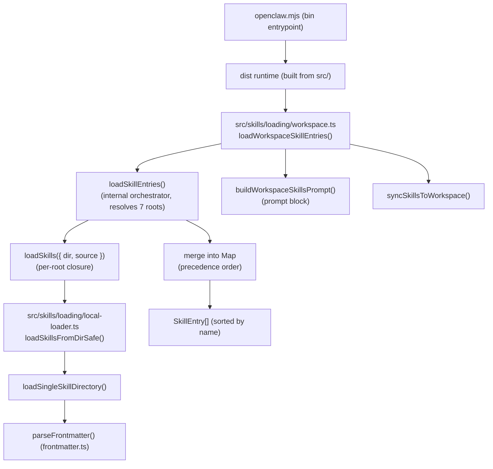

# OpenClaw Skill Loading Analysis

> **Scope:** This report explains exactly how the OpenClaw runtime discovers and loads *skills*.
> Every conclusion is grounded in the official source repository at `OpenClaw/repo`
> (absolute: `e:\Code\OpenClaw\repo`) and the shipped documentation. No behavior is assumed.
>
> **Analyst note:** All line numbers reference the source tree present in this repository checkout
> (`OpenClaw/repo`) as of 2026-07-15.

---

## Executive Summary

- A **skill** is simply a directory that contains a `SKILL.md` file with YAML frontmatter. The
  frontmatter must provide a `description` (the `name` falls back to the folder name).
  Nothing else (`skill.py`, `package.json`, …) is required.
  → `OpenClaw/repo/src/skills/loading/local-loader.ts` (`loadSingleSkillDirectory`, lines 37–89).
- The runtime scans **seven** skill roots and merges them into a single map keyed by skill *name*.
  → `OpenClaw/repo/src/skills/loading/workspace.ts` (`loadSkillEntries`, lines ~1155–1247).
- Roots are **configurable** through environment variables (`OPENCLAW_STATE_DIR`,
  `OPENCLAW_CONFIG_PATH`, `OPENCLAW_BUNDLED_SKILLS_DIR`) and the `skills.load.extraDirs` config.
- **Precedence (lowest → highest, last write wins):**
  `extraDirs` < **bundled** < **managed (`~/.openclaw/skills`)** < `~/.agents/skills`
  < `<workspace>/.agents/skills` < `<workspace>/skills`.
- **Docker-critical finding:** the bundled skills are copied into **`/app/skills`**
  (`OpenClaw/repo/Dockerfile`, line 227). **Bind-mounting your custom skills onto `/app/skills`
  overwrites (shadows) the 52 bundled skills.** The correct, officially-supported location for
  user-installed skills in the container is **`/home/node/.openclaw/skills`** (the *managed* root).

---

## 1. Skill Discovery

### 1.1 Where the runtime searches

The master orchestrator is the internal function **`loadSkillEntries`** inside
`OpenClaw/repo/src/skills/loading/workspace.ts`. It resolves the roots (lines ~1155–1206):

```ts
// src/skills/loading/workspace.ts (~1155)
const workspaceOnly = opts?.workspaceOnly === true;
const managedSkillsDir  = opts?.managedSkillsDir  ?? path.join(CONFIG_DIR, "skills");           // ~/.openclaw/skills
const workspaceSkillsDir = path.resolve(workspaceDir, "skills");                                 // <workspace>/skills
const bundledSkillsDir  = workspaceOnly ? undefined : (opts?.bundledSkillsDir ?? resolveBundledSkillsDir());
const pluginSkillsDir   = opts?.pluginSkillsDir  ?? path.join(CONFIG_DIR, "plugin-skills");      // ~/.openclaw/plugin-skills
const extraDirsRaw      = workspaceOnly ? [] : (opts?.config?.skills?.load?.extraDirs ?? []);
const extraDirs         = normalizeTrimmedStringList(extraDirsRaw);
const pluginSkillDirs   = workspaceOnly ? [] : resolvePluginSkillDirs({ workspaceDir, config: opts?.config, pluginSkillsDir });
const mergedExtraDirs   = [...extraDirs, ...pluginSkillDirs];
// ...
const personalAgentsSkillsDir = osHomeDir ? path.resolve(osHomeDir, ".agents", "skills") : path.resolve(".agents","skills"); // ~/.agents/skills
const projectAgentsSkillsDir  = path.resolve(workspaceDir, ".agents", "skills");                 // <workspace>/.agents/skills
```

### 1.2 The complete set of scanned roots

| Source label (in code)   | Directory                                              | Configurable via |
| ------------------------ | ------------------------------------------------------ | ---------------- |
| `openclaw-extra`         | Each dir in `config.skills.load.extraDirs` + plugin skill dirs | `skills.load.extraDirs` config + plugin manifests |
| `openclaw-bundled`       | `resolveBundledSkillsDir()` → repo `skills/` (Docker: `/app/skills`) | `OPENCLAW_BUNDLED_SKILLS_DIR` |
| `openclaw-managed`       | `path.join(CONFIG_DIR, "skills")` = `~/.openclaw/skills` | `OPENCLAW_STATE_DIR` / `OPENCLAW_CONFIG_PATH` |
| `agents-skills-personal` | `~/.agents/skills`                                     | OS home dir |
| `agents-skills-project`  | `<workspaceDir>/.agents/skills`                        | Workspace path |
| `openclaw-workspace`     | `<workspaceDir>/skills`                                | Workspace path |
| (plugin skills)          | Published/symlinked under `~/.openclaw/plugin-skills`  | Plugin manifests (`openclaw.plugin.json`) |

### 1.3 Hardcoded vs. configurable

The *layout* (which sub-paths are appended, e.g. `skills`, `.agents/skills`) is fixed in code, but the
*base directories* are configurable:

- **`CONFIG_DIR`** is resolved by `resolveConfigDir` in `OpenClaw/repo/src/utils.ts` (lines 80–102):

```ts
// src/utils.ts (80)
export function resolveConfigDir(env = process.env, homedir = os.homedir): string {
  const override = env.OPENCLAW_STATE_DIR?.trim();
  if (override) return resolveUserPath(override, env, homedir);        // 1st priority
  const configPath = env.OPENCLAW_CONFIG_PATH?.trim();
  if (configPath) return path.dirname(resolveUserPath(configPath, env, homedir)); // 2nd
  const newDir = path.join(resolveRequiredHomeDir(env, homedir), ".openclaw");    // default
  // ...
  return newDir;
}
// ...
export let CONFIG_DIR = resolveConfigDir();   // src/utils.ts:164 (re-pinnable via pinConfigDir)
```

- **The bundled dir** is resolved by `resolveBundledSkillsDir` in
  `OpenClaw/repo/src/skills/loading/bundled-dir.ts` (lines 37–95), which honors the
  `OPENCLAW_BUNDLED_SKILLS_DIR` env override first.

### 1.4 Are multiple directories merged?

**Yes.** All roots are loaded independently, then merged into one
`Map<string, LoadedSkillRecord>` keyed by skill name (see §6 for precedence).

---

## 2. Startup Flow (Call Chain)

**Entrypoint:** `OpenClaw/repo/package.json` declares `"bin": { "openclaw": "openclaw.mjs" }`.
`openclaw.mjs` validates the Node version and launches the compiled runtime built from `src/` into
`dist/`. In Docker the container runs `node openclaw.mjs gateway`
(`OpenClaw/repo/Dockerfile`, final `CMD`).

The module-level skill-loading call chain:



Key functions and files:

| Step | File | Function |
| ---- | ---- | -------- |
| Entrypoint | `OpenClaw/repo/openclaw.mjs` | bin launcher |
| Public API | `OpenClaw/repo/src/skills/loading/workspace.ts` | `loadWorkspaceSkillEntries` (exported, ~line 1599); `loadVisibleWorkspaceSkillEntries` (~1621) |
| Orchestrator | `OpenClaw/repo/src/skills/loading/workspace.ts` | `loadSkillEntries` (internal) |
| Per-root loader | `OpenClaw/repo/src/skills/loading/local-loader.ts` | `loadSkillsFromDirSafe` (lines 105–150) |
| Per-skill loader | `OpenClaw/repo/src/skills/loading/local-loader.ts` | `loadSingleSkillDirectory` (lines 37–89) |
| Directory scan | `OpenClaw/repo/src/skills/loading/local-loader.ts` | `listCandidateSkillDirs` (lines 91–104) |
| Frontmatter parse | `OpenClaw/repo/src/skills/loading/frontmatter.ts` | `parseFrontmatter` |
| Live reload | `OpenClaw/repo/src/skills/runtime/refresh.ts` | `resolveWatchTargets` (watches the same roots via `chokidar`) |
| Prompt build | `OpenClaw/repo/src/skills/loading/workspace.ts` | `buildWorkspaceSkillsPrompt` (~line 1495) |

---

## 3. Skill Loader

Implementation: `OpenClaw/repo/src/skills/loading/local-loader.ts`.

### 3.1 How directories are enumerated

`listCandidateSkillDirs` (lines 91–104) reads the immediate children of a root, **skips dotfiles and
`node_modules`**, and sorts them alphabetically:

```ts
// src/skills/loading/local-loader.ts (91)
function listCandidateSkillDirs(dir: string): string[] {
  try {
    return fs.readdirSync(dir, { withFileTypes: true })
      .filter((entry) => entry.isDirectory() && !entry.name.startsWith(".") && entry.name !== "node_modules")
      .map((entry) => path.join(dir, entry.name))
      .toSorted((left, right) => left.localeCompare(right));
  } catch { return []; }
}
```

`loadSkillsFromDirSafe` (lines 105–150) first checks whether the **root itself** is a skill (has its
own `SKILL.md`); if so it returns that single skill. Otherwise each immediate child directory is a
candidate. (The higher-level `workspace.ts` also supports *grouped* layouts, discovering `SKILL.md`
up to 6 levels deep — see `MAX_GROUPED_SKILL_SCAN_DEPTH`.)

### 3.2 How a valid skill is detected & required files

`loadSingleSkillDirectory` (lines 37–66):

```ts
// src/skills/loading/local-loader.ts (37)
const skillFilePath = path.join(params.skillDir, "SKILL.md");
const raw = readSkillFileSync({ ... });        // SKILL.md must exist and be readable
if (!raw) return null;
let frontmatter;
try { frontmatter = parseFrontmatter(raw); }   // frontmatter must parse
catch { return null; }
const fallbackName = path.basename(params.skillDir).trim();
const name = frontmatter.name?.trim() || fallbackName;   // name defaults to folder name
const description = frontmatter.description?.trim();
if (!name || !description) return null;         // description is REQUIRED
```

**Required folder structure / files:**

```text
<some-root>/
  my-skill/
    SKILL.md        ← REQUIRED: YAML frontmatter (needs `description`; `name` optional)
    (any other files are optional and skill-specific)
```

- **`SKILL.md` is the only mandatory file.**
- Frontmatter must contain **`description`**. `name` is optional and defaults to the directory name.
- There is **no** required `skill.py`, `package.json`, or manifest.

Frontmatter field validation lives in `OpenClaw/repo/src/skills/loading/session.ts`
(`validateName` / `validateDescription`, lines ~46–82): `name` ≤ 64 chars, pattern `^[a-z0-9-]+$`
(no leading/trailing/consecutive hyphens); `description` required, ≤ 1024 chars ("Agent Skills spec").

### 3.3 How invalid skills are handled

Failures are handled **silently and non-fatally**. `loadSingleSkillDirectory` returns `null` on any of:
missing/unreadable `SKILL.md`, frontmatter parse error, or missing `name`/`description`.
`loadSkillsFromDirSafe` then filters out the `null` entries:

```ts
// src/skills/loading/local-loader.ts (~130)
.filter((skill): skill is LoadedLocalSkill => skill !== null);
```

So a malformed skill is skipped; it never crashes loading of the other skills.

### 3.4 Security boundary

`SKILL.md` is read through `openRootFileSync` (`readSkillFileSync`, lines 15–35) so **symlinks cannot
escape the skill root**. `workspace.ts` additionally enforces containment (`isPathInsideWithRealpath`),
and bundled symlink escapes are rejected with a `bundled-symlink-escape` reason.

### 3.5 Limits

Configured in `workspace.ts` and overridable via `config.skills.limits`
(`OpenClaw/repo/src/config/types.skills.ts`): `maxCandidatesPerRoot = 300`,
`maxSkillsLoadedPerSource = 200`, `maxSkillsInPrompt = 150`, `maxSkillFileBytes = 256000`.

---

## 4. Built-in (Bundled) Skills

### 4.1 Where they live

Bundled skills are the `skills/` directory at the repo root, resolved by
`resolveBundledSkillsDir` in `OpenClaw/repo/src/skills/loading/bundled-dir.ts` (lines 37–95):

```ts
// src/skills/loading/bundled-dir.ts (37)
export function resolveBundledSkillsDir(opts = {}): string | undefined {
  const override = process.env.OPENCLAW_BUNDLED_SKILLS_DIR?.trim();
  if (override) return override;                                 // 1. env override
  // 2. bun --compile: sibling `skills/` next to the executable
  const sibling = path.join(path.dirname(opts.execPath ?? process.execPath), "skills");
  if (fs.existsSync(sibling)) return sibling;
  // 3. npm/dev: `<packageRoot>/skills`, then walk up to 6 parents looking for a skills dir
  // ...
}
```

### 4.2 In Docker they are copied to `/app/skills`

`OpenClaw/repo/Dockerfile` (line 227) copies the repo `skills/` into the runtime image at `/app/skills`
(the `WORKDIR` is `/app`):

```dockerfile
# OpenClaw/repo/Dockerfile:227
COPY --from=runtime-assets --chown=node:node /app/skills ./skills
```

Because the compiled runtime lives under `/app`, `resolveBundledSkillsDir` resolves the package root to
`/app` and therefore the bundled dir to **`/app/skills`**. They are **not** copied to
`~/.openclaw/skills`.

### 4.3 Are they loaded differently from custom skills?

They use the **same loader** (`loadSkillsFromDirSafe`) but with `source: "openclaw-bundled"`, and are
treated specially in two ways:

- Marked `bundled: true` (`OpenClaw/repo/src/skills/discovery/skill-index.ts`, ~line 87).
- Gated by an optional allowlist `config.skills.allowBundled` — `resolveBundledAllowlist` /
  `isBundledSkillAllowed` in `OpenClaw/repo/src/skills/loading/config.ts` (lines ~68–86). If that
  allowlist is non-empty, only listed bundled skills load; **non-bundled skills are unaffected**.

### 4.4 Built-in skills found (52)

```
1password, apple-notes, apple-reminders, bear-notes, blogwatcher, blucli, camsnap, clawhub,
coding-agent, diagram-maker, eightctl, gemini, gh-issues, gifgrep, github, gog, goplaces,
healthcheck, himalaya, mcporter, meme-maker, model-usage, nano-pdf, node-connect,
node-inspect-debugger, notion, obsidian, openai-whisper, openai-whisper-api, openhue, oracle,
ordercli, peekaboo, python-debugpy, sag, session-logs, sherpa-onnx-tts, skill-creator, songsee,
sonoscli, spike, spotify-player, summarize, taskflow, taskflow-inbox-triage, things-mac, tmux,
trello, video-frames, weather, xurl
```
*(Directory also contains a `pyproject.toml`, which is not a skill.)*

---

## 5. User-Installed Skills

**Yes — officially supported.** Documented in `OpenClaw/repo/docs/tools/skills.md` and
`OpenClaw/repo/docs/tools/skills-config.md`. Available avenues:

| Scope | Directory | Source label | Notes |
| ----- | --------- | ------------ | ----- |
| Shared / managed | `~/.openclaw/skills` | `openclaw-managed` | **Primary install target** used by CLI (`src/cli/skills-cli.ts`) and gateway upload (`src/gateway/server-methods/skills-upload.ts`). |
| Personal agent | `~/.agents/skills` | `agents-skills-personal` | Cross-tool "Agent Skills spec" location, all agents on the machine. |
| Project agent | `<workspace>/.agents/skills` | `agents-skills-project` | Only that workspace's agent. |
| Workspace | `<workspace>/skills` | `openclaw-workspace` | Highest precedence; per-agent. |
| Extra dirs | `config.skills.load.extraDirs` | `openclaw-extra` | Lowest precedence. |
| Plugin skills | `~/.openclaw/plugin-skills` (published) | `openclaw-extra` | Declared in `openclaw.plugin.json`. |

Documented config comment (`OpenClaw/repo/src/config/types.skills.ts`, `SkillsLoadConfig`):
> *"Additional skill folders to scan (lowest precedence). Each directory should contain skill
> subfolders with `SKILL.md`."*

---

## 6. Search Priority / Overriding / Duplicate Detection

Overriding is implemented by **insertion order into a name-keyed `Map`**
(`OpenClaw/repo/src/skills/loading/workspace.ts`, lines ~1222–1247):

```ts
// src/skills/loading/workspace.ts (~1222)
const merged = new Map<string, LoadedSkillRecord>();
const mergeRecord = (record) => { /* skip archived */ merged.set(record.skill.name, record); };
// Precedence: extra < bundled < managed < agents-skills-personal < agents-skills-project < workspace
for (const record of extraSkills)          mergeRecord(record);
for (const record of bundledSkills)        mergeRecord(record);
for (const record of managedSkills)        mergeRecord(record);
for (const record of personalAgentsSkills) mergeRecord(record);
for (const record of projectAgentsSkills)  mergeRecord(record);
for (const record of workspaceSkills)      mergeRecord(record);
```

Because `merged.set(name, record)` **overwrites**, the **last source written wins**.

### Effective precedence (highest → lowest)

| Priority | Source | Path |
| -------- | ------ | ---- |
| 1 — highest | Workspace skills | `<workspace>/skills` |
| 2 | Project agent skills | `<workspace>/.agents/skills` |
| 3 | Personal agent skills | `~/.agents/skills` |
| 4 | Managed / local skills | `~/.openclaw/skills` |
| 5 | Bundled skills | `/app/skills` (Docker) |
| 6 — lowest | Extra dirs + plugin skills | `skills.load.extraDirs`, `~/.openclaw/plugin-skills` |

This exactly matches the official table in `OpenClaw/repo/docs/tools/skills.md` ("Loading order").

- **Which one wins?** The highest-precedence source (workspace beats managed beats bundled).
- **Is overriding supported?** Yes — a same-named workspace/managed skill overrides a bundled one.
- **Duplicate detection?** Cross-source duplicates are resolved silently by the Map overwrite.
  Within plugin-skill publishing there is explicit collision logging: `collectSkillTargets`
  (`OpenClaw/repo/src/skills/loading/plugin-skills.ts`, lines ~130–170) warns
  *"plugin skill name collision … only the first will be published."*

---

## 7. Docker Implications (Your Current Setup)

### 7.1 What you currently mount

Host `E:\Code\CRM\openclaw\skills` is bind-mounted to **both**:

- `/app/skills`
- `/home/node/.openclaw/skills`

### 7.2 Verdict: **Redundant *and* potentially problematic**

**Evidence:**

1. `/app/skills` **is the bundled skills directory.** The Dockerfile copies the 52 shipped skills
   there (`OpenClaw/repo/Dockerfile:227`), and `resolveBundledSkillsDir` resolves to it. A bind mount
   onto `/app/skills` **replaces the entire directory**, so **all 52 bundled skills disappear** inside
   the container (github, weather, notion, etc.). This is a functional regression, not just noise.

2. The container runs as user **`node`** with `HOME=/home/node` (`Dockerfile`: `USER node`, and
   `/home/node/.openclaw` is pre-created). Therefore `resolveConfigDir` →
   `CONFIG_DIR = /home/node/.openclaw`, and `managedSkillsDir = /home/node/.openclaw/skills`
   (`workspace.ts:1156`). So `/home/node/.openclaw/skills` is the legitimate **managed** root.

3. Mounting the *same* host folder to both paths means the identical skills are loaded twice under two
   different `source` labels (`openclaw-bundled` **and** `openclaw-managed`). They collapse to one entry
   via the name-keyed Map, but you have needlessly elevated your custom skills to *also* masquerade as
   bundled skills — and destroyed the real bundled set in the process.

4. **Important path nuance:** `<workspace>/skills` is **not** `/home/node/.openclaw/skills`. Per
   `OpenClaw/repo/docs/install/docker.md` (line 332), the default workspace is
   `/home/node/.openclaw/workspace`, so the workspace skill root is
   `/home/node/.openclaw/workspace/skills`. Do not confuse the two.

---

## 8. Best Practice — Recommended Bind-Mount Strategy

### Recommendation: **Option B — mount only `/home/node/.openclaw/skills`.**

| Option | Verdict |
| ------ | ------- |
| A. `/app/skills` | ❌ **Do not use.** Overwrites the 52 bundled skills. |
| B. `/home/node/.openclaw/skills` | ✅ **Recommended.** This is the officially-supported *managed* skills root. |
| C. Both | ❌ Redundant + destroys bundled skills (see §7). |

**Justification (code references):**

- `managedSkillsDir = path.join(CONFIG_DIR, "skills")` — `OpenClaw/repo/src/skills/loading/workspace.ts:1156`.
- `CONFIG_DIR` defaults to `<home>/.openclaw` — `OpenClaw/repo/src/utils.ts:resolveConfigDir` (lines 80–102).
- Container `HOME=/home/node`, runs as `USER node` — `OpenClaw/repo/Dockerfile` (pre-creates
  `/home/node/.openclaw`, sets `USER node`). ⇒ managed root = `/home/node/.openclaw/skills`.
- Bundled skills occupy `/app/skills` — `OpenClaw/repo/Dockerfile:227` — and must be left intact.

Mounting the managed root keeps custom skills **outside the image**, gives them higher precedence than
bundled skills (so you *can* override a bundled skill by name if desired), and preserves the shipped
bundled catalog.

> **Alternative (also valid):** instead of mounting the managed dir, mount your skills anywhere and
> point `config.skills.load.extraDirs` at it. That keeps them at *lowest* precedence (won't override
> bundled skills) — useful when you explicitly do not want to shadow anything.

### Corrected `docker-compose` example (for the CRM project)

```yaml
# docker/docker-compose.dev.yml (skills-related excerpt)
services:
  openclaw:
    image: openclaw:latest            # bundled skills already live at /app/skills — DO NOT mount over it
    user: "1000:1000"                 # matches the image's `node` user (uid 1000); align host ownership
    environment:
      # Optional: pin state/config dir explicitly (defaults to /home/node/.openclaw).
      OPENCLAW_STATE_DIR: /home/node/.openclaw
    volumes:
      # ✅ Custom skills → managed root (highest sensible precedence, outside the image)
      - E:\Code\CRM\openclaw\skills:/home/node/.openclaw/skills

      # ❌ REMOVE this line — it overwrites the 52 bundled skills:
      # - E:\Code\CRM\openclaw\skills:/app/skills

      # (Keep your existing config/workspace/secret mounts, e.g.)
      - E:\Code\CRM\openclaw\data:/home/node/.openclaw/workspace
```

> On Windows hosts, ensure the mounted folder is writable by uid 1000, or adjust `user:` to match your
> host ownership (see `OpenClaw/repo/docs/install/docker.md` line ~515).

---

## 9. Future Development — Ideal Directory Layout

Your planned custom skills — `twenty_skill`, `resume_skill`, `github_skill`, `calendar_skill` — should
each be a self-contained folder with its own `SKILL.md`, kept on the host and mounted into the managed
root. This keeps them **outside the Docker image** (survives OpenClaw image updates) and follows the
loader's required structure exactly.

> **Naming note:** the loader validates `name` against `^[a-z0-9-]+$` (no underscores) — see
> `OpenClaw/repo/src/skills/loading/session.ts` (`validateName`). Prefer **hyphenated** skill *names*
> in frontmatter (e.g. `twenty-skill`). The *folder* name may use anything, but keeping folder and
> `name` aligned avoids surprises. Below the folders use hyphens for consistency.

### Recommended host layout

```text
E:\Code\CRM\openclaw\skills\           ← bind-mount source (host)
├── twenty-skill\
│   └── SKILL.md
├── resume-skill\
│   └── SKILL.md
├── github-skill\
│   └── SKILL.md
└── calendar-skill\
    └── SKILL.md
```

### Inside the container (after Option B mount)

```text
/home/node/.openclaw/skills/           ← managed root (your host folder)
├── twenty-skill/SKILL.md
├── resume-skill/SKILL.md
├── github-skill/SKILL.md
└── calendar-skill/SKILL.md

/app/skills/                           ← bundled catalog, LEFT UNTOUCHED (github, weather, notion, …)
```

### Minimal `SKILL.md` template

```markdown
---
name: twenty-skill
description: Interact with the Twenty CRM (create/update contacts, companies, and opportunities).
---

# Twenty CRM Skill

Instructions that teach the agent how and when to use the Twenty CRM tools…
```

### Why this survives updates

- Skills live on the **host**, mounted read/write into the managed root — pulling a newer OpenClaw
  image never touches them.
- The bundled catalog at `/app/skills` stays intact, so image upgrades keep shipping fresh built-in
  skills.
- Your custom skills sit at **managed** precedence (higher than bundled), so if OpenClaw later ships a
  bundled `github` skill you can still override it by naming yours `github` — or keep a distinct name
  like `github-crm` to coexist.

---

## Appendix — Source Location Index

| Concern | File (under `OpenClaw/repo`) | Function / symbol | Lines |
| ------- | ---------------------------- | ----------------- | ----- |
| Root resolution & merge | `src/skills/loading/workspace.ts` | `loadSkillEntries` | ~1155–1247 |
| Public API | `src/skills/loading/workspace.ts` | `loadWorkspaceSkillEntries` / `loadVisibleWorkspaceSkillEntries` | ~1599 / ~1621 |
| Prompt build | `src/skills/loading/workspace.ts` | `buildWorkspaceSkillsPrompt` | ~1495 |
| Per-root loader | `src/skills/loading/local-loader.ts` | `loadSkillsFromDirSafe` | 105–150 |
| Per-skill loader | `src/skills/loading/local-loader.ts` | `loadSingleSkillDirectory` | 37–89 |
| Directory scan | `src/skills/loading/local-loader.ts` | `listCandidateSkillDirs` | 91–104 |
| Symlink-safe read | `src/skills/loading/local-loader.ts` | `readSkillFileSync` | 15–35 |
| Bundled dir resolution | `src/skills/loading/bundled-dir.ts` | `resolveBundledSkillsDir` | 37–95 |
| Config dir resolution | `src/utils.ts` | `resolveConfigDir` / `CONFIG_DIR` | 80–102 / 164 |
| Frontmatter validation | `src/skills/loading/session.ts` | `validateName` / `validateDescription` | ~46–82 |
| Bundled allowlist | `src/skills/loading/config.ts` | `resolveBundledAllowlist` / `isBundledSkillAllowed` | ~68–86 |
| Plugin skill publish/collision | `src/skills/loading/plugin-skills.ts` | `resolvePluginSkillDirs` / `collectSkillTargets` | ~130–180 |
| Live reload watch | `src/skills/runtime/refresh.ts` | `resolveWatchTargets` | ~96+ |
| Bundled → `/app/skills` (Docker) | `Dockerfile` | `COPY … /app/skills ./skills` | 227 |
| Container user / home | `Dockerfile` | `USER node`, `/home/node/.openclaw` pre-create | ~342, final `USER` |
| Docs: loading order | `docs/tools/skills.md` | "Loading order" table | — |
| Docs: config schema | `docs/tools/skills-config.md` | `skills.load.extraDirs`, `skills.install` | — |
| Docs: Docker volumes | `docs/install/docker.md` | config/workspace mount paths | 332 |

---

*Every conclusion above is derived from the OpenClaw source repository and its shipped documentation.
No behavior was inferred without a corresponding code or documentation reference.*
